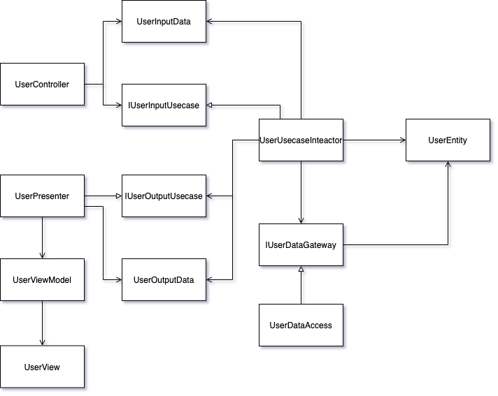

# clean-sample
Clean architecture my sample code

クリーンアーキテクチャ的なコードを書いてみた記録とメモ

フォルダ構成をどうするのが良いのかがよくわからない

## 依存関係

## メモ
* Webシステムを作ることを考えたときにPresenterのことを考え始めるとハマりそう
* フォルダ構成をどうすべきか悩んで進めなかったのでとりあえず適当にやった、個人的には機能でパッケージングしたほうが分かりやすい感じがあるけど要検討
* 

